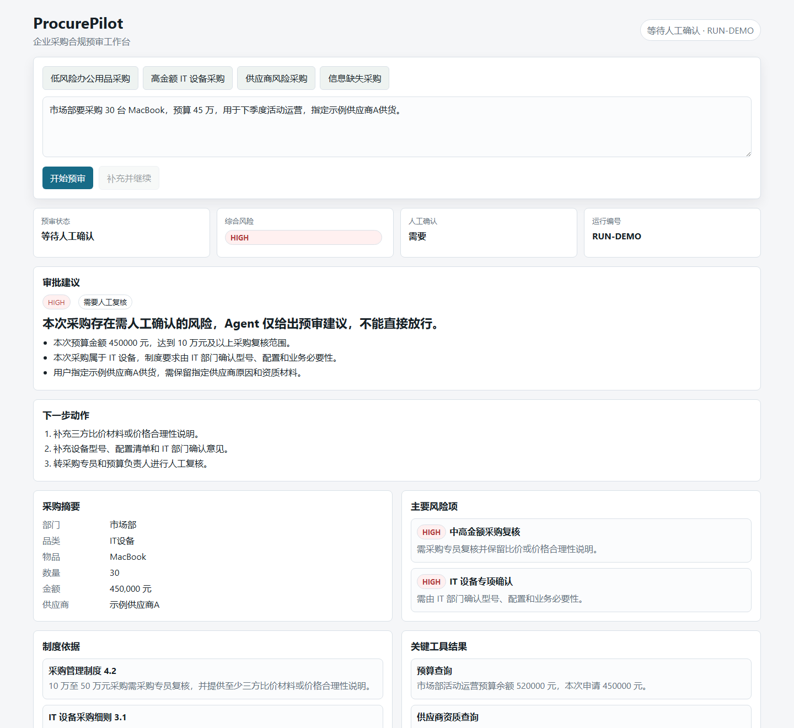

# ProcurePilot

[](https://github.com/LISONGQIhs/procurepilot/actions/workflows/ci.yml)

ProcurePilot 是一个企业采购合规预审 Agent MVP。它将自然语言采购需求转成结构化申请，结合制度检索、模拟业务工具、风险规则和人工复核节点，输出可解释的采购预审建议。



ProcurePilot is a FastAPI-based MVP for procurement compliance pre-checks. It turns a natural-language purchase request into a controlled agent workflow that extracts procurement fields, retrieves policy evidence, calls simulated business tools, assesses risk, and returns an auditable recommendation.

The project is intentionally scoped as a pre-submission compliance assistant. It is not an ERP, OA, payment, invoice, inventory, or contract system.

## Highlights

- Workflow-driven agent design instead of an open-ended chatbot.
- Optional OpenAI-compatible LLM integration with deterministic rule fallback.
- Policy retrieval with explicit citation support checks.
- Simulated business tools for budget, vendor qualification, vendor risk, historical price, and approval-chain lookup.
- Human review gates for high-risk or insufficient-evidence scenarios.
- Traceable outputs covering extracted fields, citations, tool calls, risks, recommendation, and audit events.
- Lightweight regression scripts for extraction, RAG, tool selection, risk detection, and boundary handling.

## Demo Scenarios

| Scenario | Expected behavior |
| --- | --- |
| Low-risk office purchase | Completes with a submit recommendation |
| High-amount IT purchase | Flags amount, category, vendor, price, and approval-path risks, then waits for human review |
| Vendor-risk purchase | Flags supplier risk and escalates to human review |
| Missing-information request | Asks for required fields before generating a deterministic recommendation |

## Tech Stack

| Area | Implementation |
| --- | --- |
| API | Python 3.11, FastAPI |
| Agent workflow | Explicit state machine |
| LLM | OpenAI-compatible Chat Completions API, optional |
| RAG | Lightweight keyword retrieval over local policy data |
| Frontend | Plain HTML, CSS, JavaScript |
| Data | Local JSON fixtures |
| Persistence | In-memory run store |
| Deployment | Docker and Docker Compose |

## Quick Start

```powershell
python -m venv .venv
.\.venv\Scripts\python -m pip install -r requirements.txt
.\.venv\Scripts\python -m uvicorn app.main:app --reload --host 127.0.0.1 --port 8000
```

Open:

```text
http://127.0.0.1:8000
```

By default, ProcurePilot runs without an API key and uses rule-based fallback behavior.

## Optional LLM Mode

Copy the example environment file:

```powershell
Copy-Item .env.example .env
```

Set local values in `.env`:

```text
PROCUREPILOT_LLM_ENABLED=true
OPENAI_API_KEY=<your-api-key>
OPENAI_BASE_URL=https://api.openai.com/v1
OPENAI_MODEL=gpt-4o-mini
```

`.env` is ignored by Git and Docker build context rules. Do not commit real credentials.

## Docker

```powershell
docker compose up --build
```

Then open:

```text
http://127.0.0.1:8000
```

Stop and clean up:

```powershell
docker compose down
```

## API

| Method | Path | Description |
| --- | --- | --- |
| `GET` | `/api/health` | Health check |
| `POST` | `/api/precheck` | Run a procurement pre-check |
| `GET` | `/api/runs` | List in-memory runs |
| `GET` | `/api/runs/{run_id}` | Get one run |
| `POST` | `/api/runs/{run_id}/human-review` | Submit human review result |
| `GET` | `/api/demo-cases` | Load built-in demo cases |

## Evaluation

Run the regression scripts:

```powershell
.\.venv\Scripts\python scripts\evaluate.py
.\.venv\Scripts\python scripts\check_boundary_cases.py
.\.venv\Scripts\python scripts\check_llm_compliance_flag.py
```

`scripts/evaluate.py` writes a Markdown report to:

```text
reports/evaluation-report.md
```

See [docs/evaluation.md](docs/evaluation.md) for metric details.

## Project Structure

```text
app/
  agent/       Agent workflow, extraction, and policy retrieval
  data/        Demo cases, evaluation cases, policies, and simulated business data
  llm/         Optional OpenAI-compatible LLM provider
  services/    In-memory run store
  static/      Browser UI
  tools/       Simulated business tools
scripts/       Regression and evaluation scripts
docs/          Public technical documentation
reports/       Generated evaluation report
```

## Design Notes

- LLM calls are optional and never decide final approval alone.
- Risk level, recommendation type, and human-review requirements are constrained by deterministic rules.
- Policy citations are only used as formal evidence when marked as supporting the conclusion.
- Tool outputs are kept separate from policy evidence so real-time business status and static policy knowledge remain auditable.
- The current data and business tools are fictional local fixtures for MVP demonstration, not production integrations or real enterprise records.

## Documentation

- [Architecture](docs/architecture.md)
- [Evaluation](docs/evaluation.md)

## Scope

Current MVP does not include authentication, multi-tenancy, persistent storage, real enterprise API integrations, payment, invoicing, inventory, or contract execution. Those are natural follow-up areas after the workflow, evidence, and review gates are validated.
